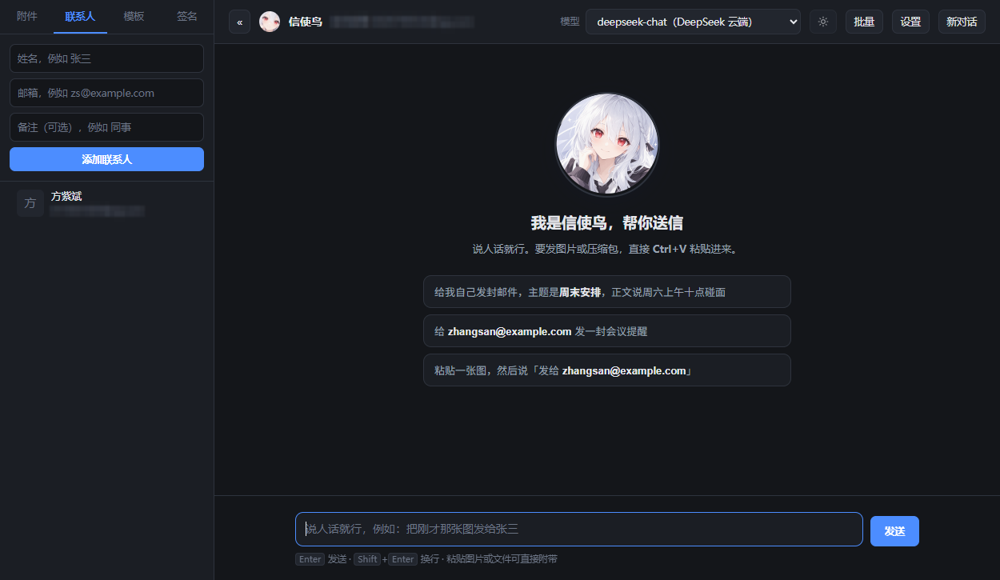
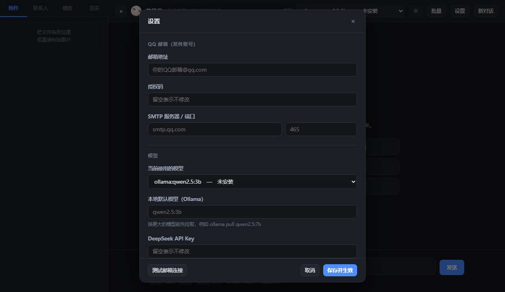
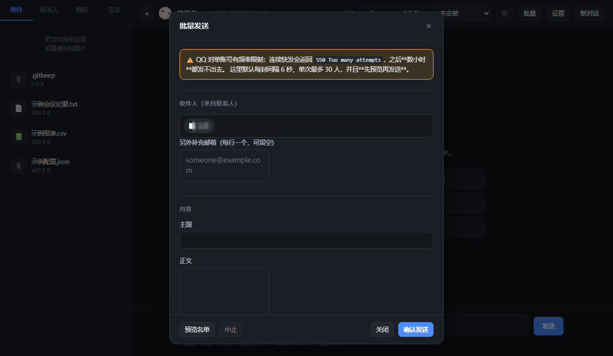

# 信使鸟 · 对话式邮件管家

> 用中文跟它说话，它就把邮件发出去。基于 **MCP 协议** + **本地大模型**，
> 附一个可以直接粘贴图片的图形界面。

一个**能真正日常使用**的邮件发送工具：不是「调通 API 的 demo」，
而是把发邮件中那些容易被忽略、却会真实出事的环节都处理了——
附件找不到就中止发送、重试不会重复发信、批量发送不会把账号打到限流。



```
你 ▸ 把这张图发给张三，主题是设计稿
  ⚙  发送带附件的邮件
       收件人: zhangsan@example.com
       主题: 设计稿
       附件: 粘贴图片_20260913.png
  ↩  ✅ 邮件发送成功
  ⏱  3.2 秒
```

左侧栏分四页：**附件 / 联系人 / 模板 / 签名**；邮箱、授权码、模型
也都能在界面里改，保存即生效。

---

## 它解决什么问题

| 真实问题 | 本项目的处理 |
|---|---|
| 附件路径写错，却回一句「发送成功」 | 附件不存在就**中止发送**并明确报错——静默跳过会让对方收到一封空邮件 |
| 小模型把文件名拼错 | 按主干/归一化逐级匹配修正，并在结果里说明替换了什么 |
| 重试导致重复发信 | 幂等键：同一个键在有效期内只真正发送一次 |
| 「发送成功」其实是猜的 | 可选 IMAP 回读确认，且**如实标注**它只能证明「QQ 已接收并归档」 |
| 每封信重新握手，慢 | SMTP 连接复用，实测 5 封邮件只建立 1 条 TLS 连接（省 328ms/封） |
| 批量群发把账号打到限流 | 强制间隔 + 数量上限 + 失败即中止，**默认值刻意保守** |

更完整的缺陷复盘（11 条真实踩过的坑）见 [`DESIGN.md`](DESIGN.md)。

---

## 功能一览

### 图形界面（推荐入口）

双击 `启动应用.bat`，弹出一个没有地址栏、没有标签页的独立窗口。

| 功能 | 说明 |
|---|---|
| **对话式发信** | 说中文即可，带多轮记忆，能接住「主题改成…」「还是发给我自己吧」 |
| **直接粘贴图片/文件** | 输入框按 `Ctrl+V`，图片与压缩包直接作为附件 |
| **联系人** | 存好之后直接说「发给张三」，不用记邮箱 |
| **邮件模板** | 常用邮件一键套用；正文进输入框可改，主题与收件人自动带上 |
| **自动签名** | 保存后每封邮件末尾自动带上，且**不会重复添加** |
| **批量发送** | 一次发给多人，带限流保护与预览（发前先看名单） |
| **切换模型** | 本地 Ollama 模型与 DeepSeek 云端模型，随时切换，对话历史保留 |
| **应用内改配置** | 邮箱、授权码、模型都能在界面里改，**保存即生效**，不用重启 |
| **主题切换** | 深色 / 浅色 / 跟随系统 |
| **动作可见** | 它决定调用哪个工具、参数是什么，**在工具执行前**就显示出来 |

设置面板（邮箱、授权码、模型都在这里改，保存即生效）：



### 终端界面

`python email_butler.py`。打印 `⚙ / ↩ / ⏱`，适合脚本与无图形环境。

**两个界面共用同一套后端**（`butler_core.py`），因此多轮改写等行为
在两边完全一致——抽出来不是为了分层好看，而是避免两份实现各自漂移。

批量发送（默认每封间隔 6 秒、单次上限 30 人、发前先预览名单）：



### MCP 服务端

基于**官方 MCP Python SDK 的 Streamable HTTP 传输层**，不是手搓的 JSON-RPC。
支持完整的 `initialize` 握手与会话生命周期，任意合规 MCP 客户端都能接入。

---

## 快速开始

### 1. 环境要求

- **Python 3.11+**
  （Windows 官方安装包默认含 `tkinter`，剪贴板图片转换需要它）
- **[Ollama](https://ollama.com)** 并已拉取模型：
  `ollama pull qwen2.5:3b`（约 1.9 GB，运行需 3–5 GB 空闲内存）
- 一个 **QQ 邮箱**账号，并开启 IMAP/SMTP 服务

> `venv/` 不在仓库里（体积大且与平台相关）。克隆后必须自己建环境。

### 2. 安装

```bash
git clone <仓库地址> && cd qqmail-mcp-tool

python -m venv venv
.\venv\Scripts\python.exe -m pip install -r requirements.txt
.\venv\Scripts\python.exe -m pip install -r requirements-dev.txt   # 跑测试才需要
```

### 3. 配置

```bash
copy .env.example .env      # Windows
# cp .env.example .env      # macOS / Linux
```

编辑 `.env`，**填两项就能用**：

```ini
SMTP_EMAIL=你的QQ邮箱@qq.com
SMTP_PASSWORD=16位授权码      # 不是 QQ 登录密码！
```

授权码获取：QQ 邮箱网页版 → 设置 → 账户 → 开启「IMAP/SMTP 服务」→ 生成 16 位授权码。

> **只想跑测试、暂时没有授权码**时用占位配置即可：
> `copy .env.test .env` 然后跑 pytest。

### 4. 启动

```bash
.\venv\Scripts\python.exe webui.py           # 图形界面（自动开窗口）
.\venv\Scripts\python.exe email_butler.py    # 终端界面
```

或者直接双击 `启动应用.bat`。

> ⚠️ **图形界面只监听 `127.0.0.1`。** 它能直接发邮件，不要暴露到局域网。

### 5.（可选）用 DeepSeek 云端模型

本地 3B 模型在附件名、多轮改写这些地方会出错；DeepSeek 明显更准
（实测一问 **1.3 秒**，本地 4–10 秒）：

```bash
.\venv\Scripts\python.exe -m pip install langchain-openai
```

再到 <https://platform.deepseek.com> 申请 API Key，在应用「设置」里填入即可。
没配 Key 时 DeepSeek 选项也会列出并说明缺什么——能提前说清楚的事，
不该等到操作失败才说。

---

## 架构

```
你 ──说人话──► 管家 ──MCP 协议──► 邮件工具 ──SMTP──► QQ 邮箱
             (本地 Ollama /        (标准工具协议)
              DeepSeek 云端)
```

```
webui.py / email_butler.py     ← 两个界面
        │
   butler_core.py              ← 共用后端：提示词、会话、MCP 生命周期
        │
   mcp_server.py               ← FastAPI + 官方 MCP 传输层（POST /mcp）
        │
   tool_defs.py                ← 工具定义的唯一真相来源（4 个工具）
        │
   email_tools.py              ← MIME 构建、发送、附件解析、结果归一
        │
   smtp_pool.py                ← 连接复用（专用线程 + 队列串行化）
```

**4 个邮件工具**：纯文本、HTML、带附件，以及配置检查。

### HTTP 端点

| 方法 | 路径 | 说明 |
|---|---|---|
| `POST` | `/mcp` | **MCP 协议端点**，需先完成 `initialize` 握手 |
| `GET` | `/health` | 健康检查（不触发外部连接） |
| `GET` | `/metrics` | 发送指标快照 |
| `GET` | `/tools` | 以纯 JSON 列出工具，便于人工查看 |

---

## 项目结构

```
qqmail-mcp-tool/
├── 启动应用.bat            # 双击启动图形界面（仅含 ASCII，避免中文路径解析问题）
│
├── butler_core.py          # 管家后端（两个界面共用：提示词、会话、MCP 生命周期）
├── webui.py                # 图形界面（FastAPI + SSE 流式推送）
├── open_window.py          # 把网页开成独立窗口（Edge --app 模式）
├── email_butler.py         # 终端界面
├── static/index.html       # 前端（原生 HTML/CSS/JS，无构建步骤）
│
├── mcp_server.py           # FastAPI + 官方 MCP 传输层
├── tool_defs.py            # 工具定义的唯一真相来源
├── email_tools.py          # MIME 构建与发送
├── smtp_pool.py            # SMTP 连接复用
├── delivery.py             # 发送确认（IMAP 回读）
├── retry.py                # 重试策略与错误分类
├── idempotency.py          # 幂等键
├── metrics.py              # 发送指标
├── auth.py                 # /mcp 的 Bearer 鉴权
│
├── config.py               # 配置（pydantic-settings）
├── envfile.py              # .env 读写（应用内改配置：保留注释、原子写、脱敏读）
├── userdata.py             # 联系人 / 模板 / 签名
├── batch.py                # 批量发送（限流保护）
├── clipboard.py            # 剪贴板导入（终端 /粘贴）
├── create_attachments.py   # 生成示例附件
├── run_server.py           # 只启动服务器
│
├── docs/                   # 界面截图
├── tests/                  # 507 个用例，全程离线
├── attachments/            # 附件目录（已整体 gitignore）
└── data/                   # 联系人/模板/签名（已 gitignore）
```

---

## 测试

```bash
.\venv\Scripts\python.exe -m pytest -q
```

**507 个用例，全程离线**——替换 `smtplib.SMTP_SSL` 与 `imaplib.IMAP4_SSL`
为记录型替身，用 `httpx.ASGITransport` 在进程内驱动真实 MCP 协议栈。
不联网、不碰真实邮箱、约 20 秒跑完。

几个值得单独看的用例：

| 用例 | 它在防什么 |
|---|---|
| `test_worker_initialization_is_thread_safe` | 8 并发曾建立 8 条本应唯一的连接 |
| `test_explicit_directory_does_not_fall_back_to_attachment_dir` | 指了目录却去附件目录搜同名文件 = **发错文件** |
| `test_mcp_headers_sends_bearer_token` | 客户端不发令牌，导致鉴权只能关掉、服务器裸奔 |
| `test_api_never_leaks_credentials` | 响应全文与真实授权码逐字比对 |
| `test_batch_rejects_whole_batch_when_any_recipient_is_bad` | 批量里静默跳过 = 你以为所有人都收到了 |
| `test_tests_never_write_to_the_real_attachment_dir` | 测试写进真实目录（踩过一次） |

---

## 局限（写清楚，不回避）

| 局限 | 说明 |
|---|---|
| **QQ 有限流** | 触发后返回 `550 Too many attempts`，需等数小时。别连续快发 |
| **「发送成功」≠ 对方收到** | 只代表投递到服务器。开 `EMAIL_CONFIRM_DELIVERY` 可多一层证据，但**它也证明不了**对方收到 |
| **邮件发出后无法撤回** | SMTP 没有撤回机制。发前确认是唯一的办法 |
| **只支持 QQ 邮箱** | SMTP/IMAP 地址与授权码方式都是 QQ 特有的 |
| **不支持回复/转发** | 未实现 `In-Reply-To` / `References` |
| **不支持内嵌图片** | 图片只能当附件 |
| **幂等键是进程内内存** | 进程重启即失效；跨重启需换共享存储 |
| **`/mcp` 无 TLS** | 对公网暴露必须加反向代理 |
| **本地小模型会自作主张** | 3B 模型在你没给全信息时会自己补全主题正文——看 `⚙` 那几行确认 |

---

## 安全须知

- **`.env` 绝不入库**。所有读取凭据的位置都集中在 `config.py`，
  源码中不存在硬编码凭据（由 `tests/test_config.py` 固化）。
- **不要把授权码贴给任何人或工具**（聊天软件、AI 助手、工单、截图）。
  「贴出来再删掉」没有用——消息记录里已经有了。
  泄露后到 QQ 邮箱**重新生成**即可，不需要改 QQ 密码。
- **图形界面只监听 `127.0.0.1`**。
- **`/mcp` 对外提供服务时必须设置 `MCP_AUTH_TOKEN`**——
  否则同一局域网内任何人都能用你的邮箱发信。详见 [`DESIGN.md`](DESIGN.md)。

---

## 文档

| 文档 | 内容 |
|---|---|
| **`README.md`** | 本文件 —— 项目总览与上手 |
| [`DESIGN.md`](DESIGN.md) | 设计决策与 11 条真实缺陷复盘（技术重点） |
| [`MANUAL.md`](MANUAL.md) | 使用手册：日常发信、附件、批量、排障 |
| [`PROJECT.md`](PROJECT.md) | 一页速览（快速了解） |
